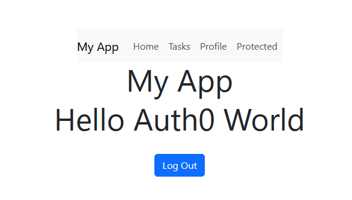
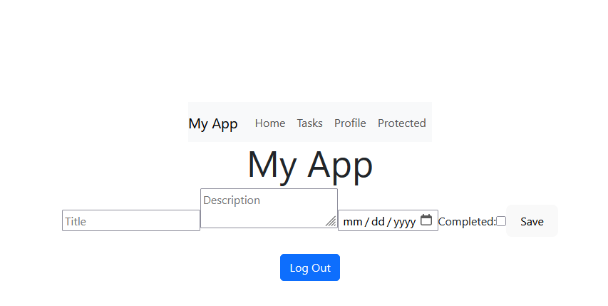
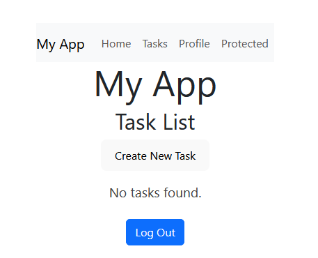
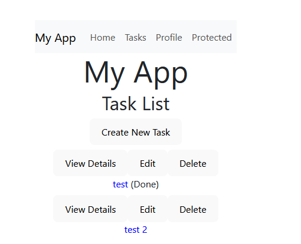
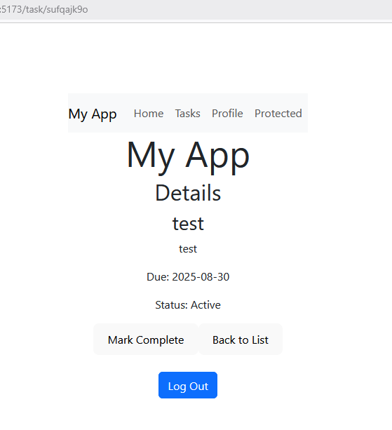
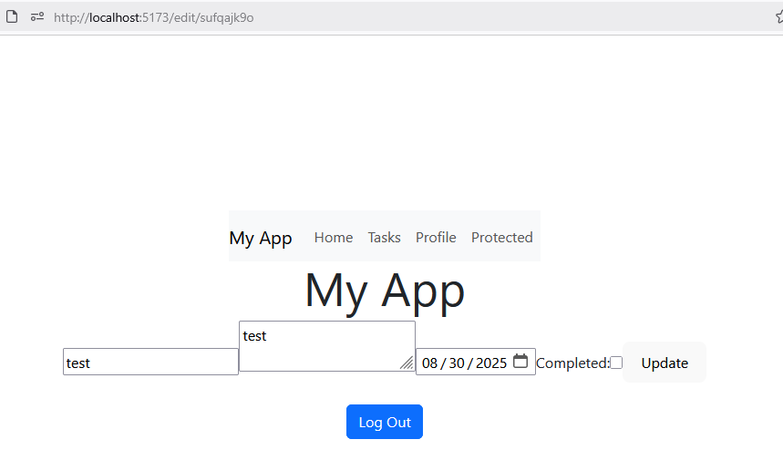
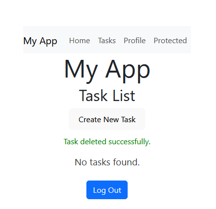
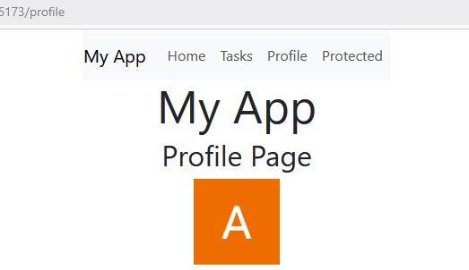
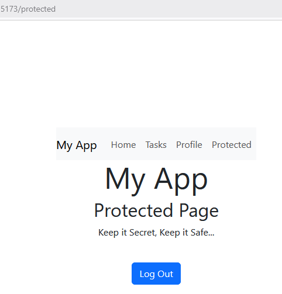
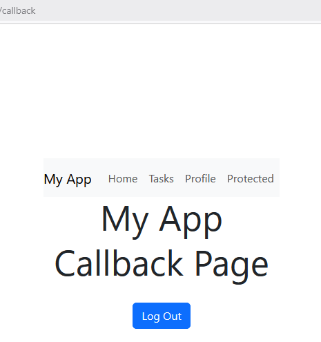

# Task Manager App

A robust task management tool built with React and TypeScript.  
Features authentication (Auth0), global state (Context API), and full CRUD task management.

## Features

- Task dashboard: create, edit, delete, view tasks
- Task details page
- Edit tasks with validation
- Auth0 authentication/authorization
- Global state with Context API
- Typed hooks and components using TypeScript
- Form validation and error handling

## Getting Started

### Installation

```bash
git clone https://github.com/resenaros/Task-Manager-App.git
cd task-manager
npm install
```

### Setup Auth0

1. Create Auth0 account and application
2. Set your Auth0 domain and client ID in `.env` or your build setup:
   ```
   VITE_AUTH0_DOMAIN=your-domain
   VITE_AUTH0_CLIENT_ID=your-client-id
   ```
3. Start the app:
   ```bash
   npm run dev
   ```

## Usage

- Register/login with Auth0
- View, create, edit, and delete tasks
- View profile and protected pages

## Technology Stack

- React
- TypeScript
- React Bootstrap
- Auth0
- Context API

## Architecture

- **Auth0Provider** wraps the app for authentication
- **TaskProvider** manages global task state
- **Validation** utility for form error handling
- **Routing** for dashboard, task details, create/edit, and profile pages
- **Protected routes** via AuthenticationGuard

## Screenshots

_Add screenshots of dashboard, form, profile, etc_












